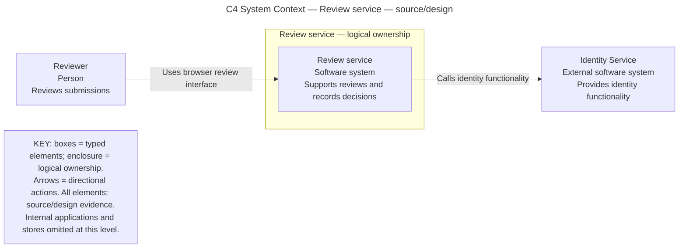
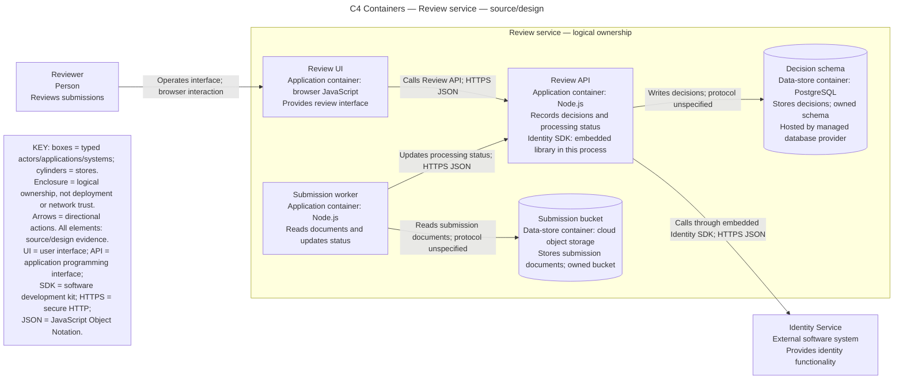

Captain, these views model the supplied synthetic source/design description, dated 2026-10-07. Implementation and live deployment are unverified. “Review service” is the model’s chosen system name.

The SDK shares the API’s process; the UI and worker are separate containers. Managed hosting does not move the owned schema or bucket outside the logical system. Hosting topology, network trust zones, and unspecified storage protocols remain unknown.

Validation receipt: `mmdc` and `mermaid` were absent from `PATH`; Node.js `v22.23.1` could not resolve `mermaid`, `@mermaid-js/mermaid-cli`, or `@mermaid-js/parser`. No parser pass or visual layout verification is claimed. No files changed, delegation performed, or services contacted.